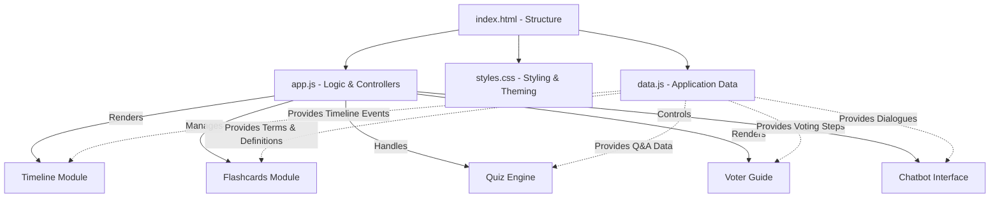
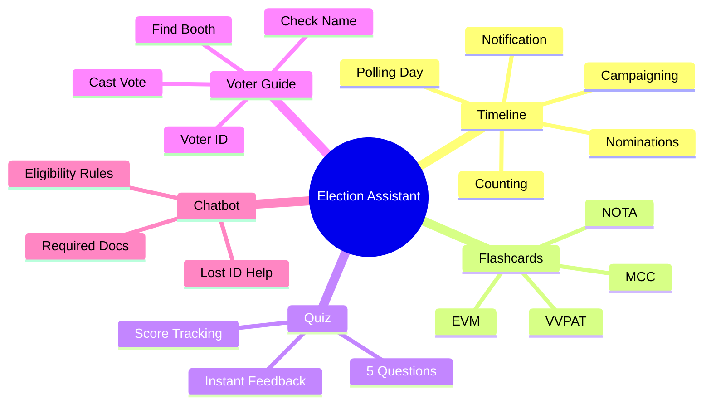

# India Votes - Smart Voter Help Assistant

**Problem Statement:**
Many citizens, especially first-time voters, face confusion about voter registration, required documents, polling day rules, voter rights, and reliable election information. This lack of awareness can reduce participation and increase dependence on misinformation.

**Solution:**
India Votes is an interactive voter assistance platform that provides step-by-step guidance, an AI-powered election help chat, voter checklists, election education, fake news awareness, and accessible information to help citizens participate confidently in the democratic process.

## Features

- **Am I Ready to Vote? Checker:** An interactive checklist helping users determine their election day readiness.
- **Dynamic Help Dashboard:** Personalized, step-by-step guides for real-life problems (e.g., lost voter ID, first-time voter).
- **Interactive Election Map:** Clickable map of India showing state-specific electoral data using Google GeoChart.
- **Fake News Check:** A dedicated section teaching users how to verify claims and avoid misinformation.
- **Process Timeline:** A step-by-step visual representation of how elections are conducted in India.
- **Flashcards & Quiz:** Interactive tools to learn key election terminology (EVM, VVPAT) and test your knowledge.
- **Smart Election Chat:** An interactive chatbot providing answers to practical voting questions and common scenarios.

## Technology Stack

- **HTML5:** Semantic structure
- **CSS3:** Custom styling, glassmorphism, responsive design (Vanilla CSS)
- **Vanilla JavaScript:** DOM manipulation, interactive logic, and state management
- **Google Charts:** Lightweight GeoChart for the interactive map

## Architecture & Data Flow Diagram



## Setup & Usage

Simply clone the repository and open `index.html` in your favorite modern web browser. No local server, build tools, or package managers are required!

```bash
git clone https://github.com/codewithnayek/Interactive-Election-Assistant.git
cd Interactive-Election-Assistant
# Open index.html in any modern browser
```

## Module Overviews



## Contributing

Contributions, issues, and feature requests are welcome!

---
*Built to promote democratic awareness and education.*