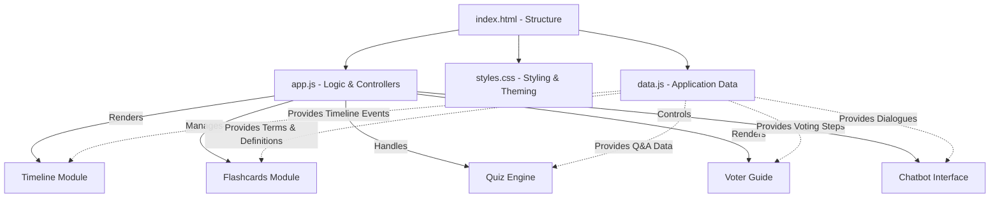
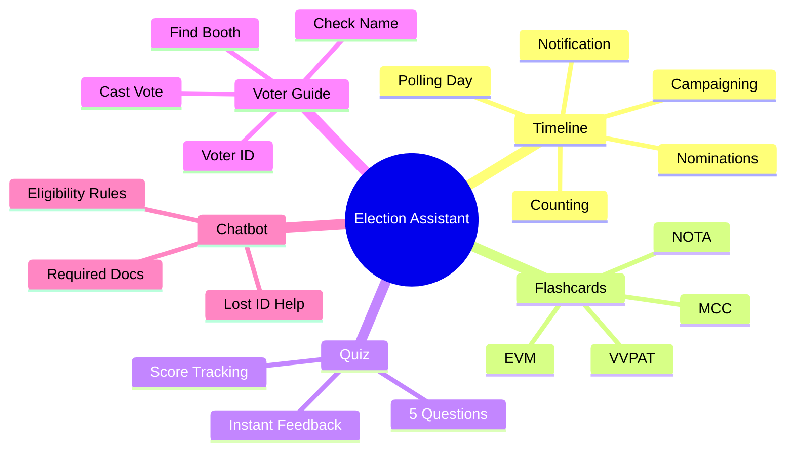

# Interactive Election Assistant

An interactive web-based guide to understanding the Indian Election System. This platform aims to educate users about the largest democratic process in the world through engaging and interactive modules.

## Features

- **Process Timeline:** A step-by-step visual representation of how elections are conducted in India, from announcement to results.
- **Flashcards:** An interactive tool to learn key election terminology (e.g., EVM, VVPAT, Model Code of Conduct).
- **Quiz:** Test your knowledge about the Indian democratic process with an interactive quiz.
- **Voter Guide:** A step-by-step practical guide on how to exercise your franchise and vote on election day.
- **Election Chat:** An interactive chatbot interface providing answers to common questions regarding the election process.

## Technology Stack

- **HTML5:** Semantic structure
- **CSS3:** Custom styling, glassmorphism, responsive design, animations (Vanilla CSS)
- **Vanilla JavaScript:** DOM manipulation, interactive logic, and state management

## Architecture & Data Flow Diagram



## Setup & Usage

Simply clone the repository and open `index.html` in your favorite modern web browser. No local server, build tools, or package managers are required!

```bash
git clone https://github.com/codewithnayek/Interactive-Election-Assistant.git
cd Interactive-Election-Assistant
# Open index.html in any modern browser
```

## Module Overviews



## Contributing

Contributions, issues, and feature requests are welcome!

---
*Built to promote democratic awareness and education.*